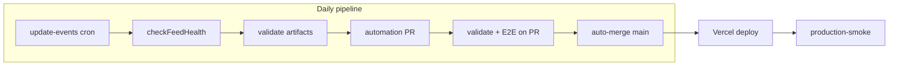

# Cal Events Discovery

UC Berkeley campus events in one searchable feed. The site ships a static snapshot (~900+ upcoming events) built from 10 Berkeley sources, updated daily by GitHub Actions, hosted on Vercel at [cal-events.com](https://cal-events.com).

## Quick start

**Requirements:** Node 22+, npm 10+

```bash
git clone https://github.com/akhil-neelam-ai/Cal-Events-Discovery.git
cd Cal-Events-Discovery
npm ci
npm run dev          # http://localhost:5173
```

The app reads committed artifacts in `public/`. To refresh them locally:

```bash
npm run update-events
```

## Commands

| Command | What it does |
|---------|--------------|
| `npm run dev` | Vite dev server |
| `npm run build` | Typecheck + production build → `dist/` |
| `npm run typecheck` | `tsc --noEmit` only |
| `npm run validate` | Lint, format, typecheck, script tests, UI tests |
| `npm run update-events` | Full ingestion pipeline → `public/*.json` |
| `npm run test:e2e` | Build + Playwright |
| `vercel --prod` | Deploy to Vercel |

## How it works

```
Berkeley sources (iCal, REST, HTML scrapers)
        ↓
scripts/updateEvents.ts  (parallel adapters, dedupe, fallback)
        ↓
public/events.json       (~1 MB, published events)
public/search-index.json (~370 KB, inverted index)
public/status.json       (per-source health)
        ↓
React app loads JSON client-side, search runs in-browser
        ↓
Vercel CDN → cal-events.com
```

1. **Ingestion** — `scripts/updateEvents.ts` runs 10 source adapters in parallel (60s timeout each), dedupes, writes three JSON files.
2. **Automation** — Daily cron opens a PR on `automation/update-events` with updated artifacts.
3. **Merge** — PR runs validate + E2E, auto-merges to `main` if green.
4. **Deploy** — Vercel deploys `main`. Production smoke test hits live URLs.

Deep architecture: see [ARCHITECTURE.md](./ARCHITECTURE.md). Agent/adapter details: see [CLAUDE.md](./CLAUDE.md).

## CI/CD workflows

| Workflow | Trigger | Purpose |
|----------|---------|---------|
| **Validate** | PR + push to `main` (ignores artifact-only commits) | Lint, format, typecheck, 94+ tests, npm audit |
| **Browser E2E** | PR + push to `main` (ignores artifacts) | Playwright against production build |
| **Update Events Daily** | 4:00 AM Pacific (cron) + manual | Fetch sources, health check, open automation PR, auto-merge |
| **Source Contracts** | Weekly Monday + manual | Live HTTP checks against all 9 Berkeley endpoints |
| **Production Smoke** | Every push to `main` | Verify `cal-events.com` serves fresh events + status |



## GitHub secrets

Set these in **Settings → Secrets and variables → Actions**:

| Secret | Required | Purpose |
|--------|----------|---------|
| `AUTOMATION_PR_TOKEN` | **Yes for cron** | PAT with `contents` + `pull_requests` write. Lets the automation PR trigger downstream E2E and auto-merge. Scheduled runs fail without it. |

`workflow_dispatch` runs work without `AUTOMATION_PR_TOKEN`, but the PR won't auto-merge.

## Reading `status.json`

After every pipeline run, check `public/status.json` (or `https://cal-events.com/status.json`):

```json
{
  "generated_at": "2026-05-23T18:54:15.982Z",
  "total_events": 942,
  "degraded": false,
  "fallback_used": false,
  "sources": [{ "name": "livewhale", "ok": true, "count": 1296, ... }]
}
```

| Field | Meaning |
|-------|---------|
| `degraded` | At least one source failed or fell below its health threshold |
| `fallback_used` | Stale events from the previous snapshot were restored for a failing source |
| `fallback_age_hours` | How old the fallback data is |
| `data_quality_blocked` | Pipeline refused to publish (strict mode in CI) |

**Thin coverage warnings** (non-blocking): CalLink returning 1 event when ≥5 is expected, etc. Surfaced as `::warning::` in CI via `scripts/lib/sourceCoveragePolicy.mjs`.

## Troubleshooting

### Daily cron failed

1. Open the failed run in **Actions → Update Events Daily**.
2. Check for an open issue labeled **`pipeline-failure`** (auto-created on failure).
3. Common causes:
   - Missing `AUTOMATION_PR_TOKEN` on scheduled runs
   - Critical source down with no fallback (`checkFeedHealth` blocks)
   - `npm run validate` failed on the automation PR

Re-run manually: **Actions → Update Events Daily → Run workflow**.

### Production data looks stale

1. Hit `https://cal-events.com/status.json` — check `generated_at`.
2. Check if an open `automation/update-events` PR is stuck unmerged.
3. **Production Smoke** workflow on `main` fails if status is >36h old.

### A source broke (Berkeley changed their site)

1. **Source Contracts** workflow (weekly) catches this early.
2. Run locally: `node scripts/runSourceContracts.mjs`
3. Fix the adapter in `scripts/sources/`, add a parser test in `scripts/tests/`.

### Local health check

```bash
node scripts/checkFeedHealth.mjs          # exits 1 on blocking issues
node scripts/runSourceContracts.mjs       # live endpoint smoke
npm run validate                            # full test suite
```

## Sources

| Source | Adapter | Method |
|--------|---------|--------|
| LiveWhale (campus calendar) | `livewhale.ts` | iCal + 35 department group feeds |
| CalLink (student orgs) | `callink.ts` | CampusGroups JSON API (~16 event cap) |
| Cal Performances | `cal_performances.ts` | WordPress REST |
| Cal Bears athletics | `calbears.ts` | iCal |
| BAMPFA | `bampfa.ts` | HTML scraper |
| Berkeley Haas / Law / BEGIN | `tribe.ts` | Tribe Events Calendar REST |
| Simons Institute | `simons.ts` | JSON API |
| Berkeley E-Hub | `ehub.ts` | HTML scraper |
| Luma (Berkeley calendars) | `luma.ts` | Luma JSON API |

## Deploy

Vercel auto-deploys `main`. Manual deploy:

```bash
npm run build
vercel --prod
```

Post-deploy verification runs automatically via **Production Smoke** on every `main` push.

## Notes

- `services/eventsLoader.ts` only loads static JSON in the browser.
- GA4 in `utils/analytics.ts` sends search terms to analytics. The measurement ID is public; tune retention in GA4 if needed.
- Pipeline deps (`cheerio`, `node-ical`, etc.) are in `dependencies` for CI script runs but are not bundled into the frontend.
