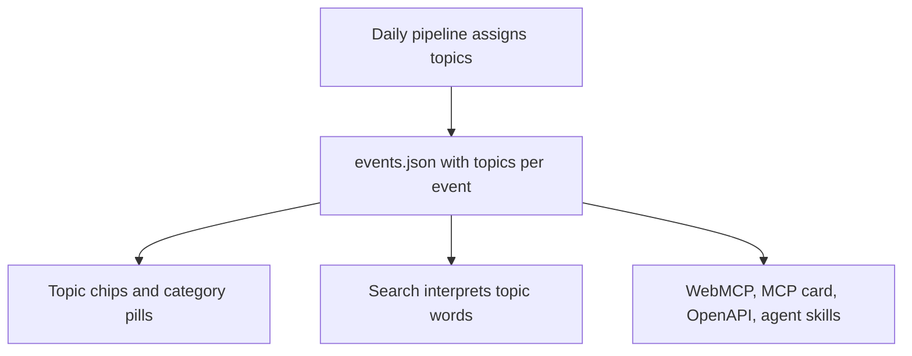

# Topic filter layer

## Summary

Add a topic filter alongside the six category pills. Roughly 20 topics, spanning research fields (AI, Law, Biology) and student interests (Film, Career, Free Food), assigned to each event by the daily pipeline. Clicking a topic shows every event carrying it across all categories. Typing a topic word in search applies the topic filter instead of locking a category. The search fix ships first as its own deliverable. The topic layer follows.

---

## Problem Frame

The site holds 1,450 events. The only way to narrow by subject is six category pills, and they are lopsided: Academic holds 557 events, Sports 322, Arts 249, Science & Tech 144, Student Life 127, Entrepreneurship 51. Academic mixes a plant-biology seminar, a free coffee hour, an HR training course, and a law-school job-mapping session under one pill. 71% of events carry a single tag, so there is no second axis to fall back on. A person who picks Academic is left scrolling.

Search does not rescue this. Typing "AI" triggers the Science & Tech category as a hard filter before any ranking runs. There are 56 AI-related events in the corpus, but only 16 sit in Science & Tech. The other 40 live in Academic, Arts, and Entrepreneurship and are removed before the text engine sees them. In the "This Week" view the Science & Tech pool is 9 events, almost none about AI, so the top results are coral reef dynamics and neuroscience. With the category chip dismissed, the same query ranks 52 AI events at the top. The text engine works. The category lock hides most of what was asked for.

So the site has a taxonomy that is too coarse to browse, and a search interpretation that turns subject words into the wrong kind of filter. Both need to change. They do not need to change together: the search fix is a one-file change to the engine's category trigger table and needs no pipeline, classifier, or chip work, so it ships first.

---

## Key Decisions

- **Topics are an independent axis, not a tree under categories.** AI events are spread across Academic, Science & Tech, Arts, and Entrepreneurship. A category-then-topic tree would either repeat AI under four parents or hide most of it. Two independent filters let a topic show all of itself, and a category on top narrows it further.

- **Topics are strictly finer than categories.** The vocabulary never duplicates a category name. There is no "Sports" topic and no "Entrepreneurship" topic. Under Arts the topics are Film, Music, Theater, Visual Arts. This stops the two filters from overlapping.

- **One vocabulary, displayed as two groups.** Fields and Interests are shown as two labeled groups of chips, but they draw from a single topic list per event. An AI art exhibition carries both AI and Visual Arts. Two separate filters would force it to pick a side.

- **Single-select topic in the first version.** Matches how the category pills behave today. Picking more than one topic at once is deferred.

- **Assignment happens in the daily pipeline, not in the browser.** Topics are computed once per day and published in the events file, the same way categories are. The client filters on a field; it does not classify.

- **Search interprets topic words as topic filters.** "AI", "robotics", "machine learning", "film", "theater" and similar terms set the topic filter and show an interpretation chip for it. They no longer lock a category. The chip is dismissable, as category chips are now.

- **The search fix ships first, on its own.** Removing subject words from the category trigger table so they rank as text, and updating the "AI talks" hero preset that hardcodes Science & Tech, is a separable change with the most evidence behind it. It ships and is measured before the topic layer lands. Once topics exist, R12 upgrades the same words from text ranking to a topic filter.

- **Chip row over dropdown.** A dropdown next to Source would hide the feature from anyone who does not already know to look. The chips must handle roughly 20 topics without the silent overflow the April audit flagged, so each group shows its most common topics with an affordance for the rest. On the phone layout the category pills already live behind a Filters toggle, so the discoverability argument does not apply there. Topics join that drawer and the active topic shows in the Filters badge.

- **Vocabulary seeded from the corpus, finalized in planning.** The seed list below comes from a keyword pass over the live corpus and the search engine's existing synonym table. The exact names and count are settled during planning against real assignment results.

- **Assignment method is a planning decision, with one constraint.** Rules, an AI classifier, or a mix are all open. If a classifier is used, it needs a new API secret in the daily cron, and the publish gate must never wait on it. A classifier outage degrades topics; it does not stop the feed.

---

## Actors

- A1. **Field-seeker.** A student or researcher who knows the subject they want and reaches for words like AI or quantum. The primary user this layer is designed for.
- A2. **Browser.** A student looking for something to do who thinks in interests: film, live music, free food, a career fair. Served by the Interests group.
- A3. **Agent client.** A tool calling the site's WebMCP tools, MCP server card, or reading the machine-readable feeds. Must be able to filter by topic the same way a person can.
- A4. **Daily pipeline.** Assigns topics to every event once per day and publishes them.

---

## Requirements

**Topic vocabulary and assignment**

- R1. A fixed vocabulary of roughly 20 topics, organized into two groups, Fields and Interests. No topic name duplicates a category name. Each topic has a stable identifier distinct from its display label, so a label can change without breaking links or agent calls.
- R2. Every published event carries zero to three topics from the vocabulary. An event with no confident topic carries none rather than a guess.
- R3. Topics are assigned in the daily pipeline and published in the events file alongside category tags. The browser reads them; it does not compute them.
- R4. Assignment precision is high enough to trust. A spot check of any topic's events should find at least nine in ten clearly relevant. A Labor Day picnic must not appear under AI.
- R4b. Assignment recall is high enough that the search-typed topic filter does not hide events. For each Fields topic with a reference set, starting with the 56 keyword-identified AI events, at least nine in ten reference events carry the topic. Reference sets are maintained independently of the assignment rules so the check is not circular. R12 depends on this floor.
- R5. Topic assignment never blocks publishing. If the assignment step fails or times out, the feed still publishes. Events present in the previous publish keep their prior topics, keyed by event id; only never-seen events go untagged. The run writes a dedicated topics block to the status report (ok or error, assigned count, carried-forward count) and opens or updates a data-quality issue through the existing non-blocking path. The degraded-source flags, and the partial-data and stale-data banners that key off them, are not touched by a topic failure.

**Topic filter in the interface**

- R6. A topic control sits with the existing filter bar and is reachable whether or not a category is selected.
- R7. Topics render as chips in two labeled groups. Each group shows its most common topics first and provides a way to reach the rest without silent horizontal overflow at laptop widths.
- R7b. On the mobile layout, topics are reachable from the filter drawer alongside category and source. The active topic counts in the Filters badge and appears in the drawer summary line.
- R7c. A skip-to-content link precedes the filter bar so keyboard users can bypass the chips and reach the first event. This closes audit finding H1 and is a prerequisite of adding roughly 20 focusable chips.
- R8. Selecting a topic shows every event carrying it across all categories, subject to the active date range and source.
- R9. A category and a topic can be active at the same time. The result is the events matching both.
- R10. One topic is active at a time. Selecting another replaces it. Clicking the active chip toggles it off. That single action is what clears a topic from every entry point, including the interpretation chip's dismiss in R14.
- R11. A topic's available state is computed from every active filter: date range, source, and any selected category. Topics with no events under the current combination are shown as unavailable or hidden, never as a chip that yields an empty list. If a later filter change leaves the active topic with zero events, the topic is cleared automatically and a brief note says so.

**Search interpretation**

- R12. Typing a topic word or its synonyms sets the topic filter and shows an interpretation chip for that topic. It does not set a category. Topic detection runs before category, free, and modality detection and strips its matched words from the text those detectors see, so a query word sets at most one hard filter. Any word in the topic synonym list is removed from the category trigger table. When a query contains more than one topic word, the first in query order becomes the filter and the rest stay as ranking text under R13. A topic chosen by clicking a chip overrides a query-interpreted topic, mirroring today's category rule. If the topic pool is empty for the current filters, the topic filter relaxes with a fallback message, as the category fallback does today.
- R13. The residual text after topic interpretation still ranks results, so "AI ethics" narrows to AI and ranks ethics-related events first.
- R14. Dismissing a topic interpretation chip triggers the same clear action as R10, removes the topic filter, and re-runs the search over all events, as dismissing a category chip does today.

**Shareable state**

- R15. The active topic is carried in the URL alongside query, date range, category, source, and selected event. A shared link reproduces the same view.

**Agent parity**

- R16. Every agent surface that exposes category filtering exposes topic filtering with the same semantics: the WebMCP search tool, the MCP server card, the agent skill for searching events, and the machine-readable feed descriptions. Each surface accepts the topic identifier from R1 and validates it against the vocabulary published under R17 rather than repeating an enumeration of its own. The OpenAPI description, which has no filter parameters, documents the topic field and points at that vocabulary.
- R17. The published events file carries the topic field on each event and a vocabulary block listing every topic's identifier, label, and group. That block is the single source the interface, URL validation, and every agent surface read. The list is not duplicated in code.

---

## Key Flows

- F1. Browse by topic
  - **Trigger:** A1 opens the site and wants AI events.
  - **Actors:** A1
  - **Steps:** Sees the Fields group of chips. Clicks AI. The list shows every AI event in the current date range across all categories, with a count.
  - **Outcome:** All AI events in one list, no scrolling through Academic.
  - **Covers:** R6, R7, R8, R11

- F2. Category then topic
  - **Trigger:** A1 has already selected Academic.
  - **Actors:** A1
  - **Steps:** Clicks AI in the Fields group. The list narrows to Academic events that carry AI.
  - **Outcome:** The intersection, not a replacement of the category.
  - **Covers:** R9, R10

- F3. Search for a topic word
  - **Trigger:** A1 types "AI" into the search box.
  - **Actors:** A1
  - **Steps:** The engine interprets AI as a topic, shows an "AI" interpretation chip, and ranks every AI event across categories. A1 can dismiss the chip to search all events by text.
  - **Outcome:** The 56 AI events, ranked, regardless of category.
  - **Covers:** R12, R13, R14

- F4. Browse by interest
  - **Trigger:** A2 wants something to do Friday night.
  - **Actors:** A2
  - **Steps:** Sees the Interests group. Clicks Film. Sets the date range to this week.
  - **Outcome:** Screenings this week from BAMPFA, campus film series, and any department showing a film.
  - **Covers:** R6, R7, R8

- F5. Agent filters by topic
  - **Trigger:** A3 calls the WebMCP search tool for AI events this week.
  - **Actors:** A3
  - **Steps:** Passes a topic argument. Receives the same events a person would see in F1 with the week range.
  - **Outcome:** Agent and person get the same answer.
  - **Covers:** R16, R17

- F6. Daily assignment
  - **Trigger:** The scheduled pipeline run.
  - **Actors:** A4
  - **Steps:** Fetches all sources, dedupes, assigns topics to each event, writes the events file. If assignment fails, events seen in the previous publish keep their prior topics by id, never-seen events carry none, and the status report records the failure and the carried-forward count.
  - **Outcome:** Fresh feed every day. Topics are fresh when assignment succeeded and carried forward when it did not.
  - **Covers:** R2, R3, R5

---

## Acceptance Examples

- AE1. Search no longer locks a category
  - **Covers:** R4b, R12, R14
  - **Given** the live corpus and a maintained reference set of 56 AI-related events across four categories
  - **When** a person types "AI" with the date range set to All Events
  - **Then** the interpretation chip reads "AI", not "Science & Tech", and at least 50 of the 56 reference events are in the result set

- AE2. Category and topic intersect
  - **Covers:** R9
  - **Given** Academic is selected
  - **When** the AI topic is selected
  - **Then** the list contains only events tagged both Academic and AI, and the count shown matches

- AE3. Topic replaces topic
  - **Covers:** R10
  - **Given** AI is the active topic
  - **When** Law is clicked
  - **Then** AI is no longer active, Law is, and the URL reflects Law

- AE4. Empty topics do not appear
  - **Covers:** R11
  - **Given** the date range is Today and no event today carries Quantum
  - **When** the Fields group renders
  - **Then** Quantum is absent or visibly unavailable, and clicking it, if visible, is not possible

- AE5. Assignment failure does not stop the feed
  - **Covers:** R5
  - **Given** the topic assignment step errors during a daily run
  - **When** the run completes
  - **Then** the events file is still published, events seen before keep yesterday's topics, never-seen events carry none, the status report's topics block names the failure and the carried-forward count, and no partial-data or stale-data banner appears

- AE6. Chips do not silently overflow
  - **Covers:** R7
  - **Given** a 1024-pixel-wide viewport
  - **When** the filter bar renders with both groups
  - **Then** every topic is reachable through a visible affordance, and nothing is cut off without indication

- AE7. Source and category empty a topic
  - **Covers:** R11
  - **Given** the source is set to BAMPFA and no BAMPFA event carries Law
  - **When** the Fields group renders
  - **Then** Law is absent or visibly unavailable, even though Law has events under other sources

- AE8. Topics reachable on a phone
  - **Covers:** R7b
  - **Given** a 390-pixel-wide viewport
  - **When** the Filters drawer is opened and AI is selected
  - **Then** the drawer summary line and the Filters badge both show AI, and the list matches F1

---

## Success Criteria

- Typing "AI" on the live site returns at least 50 of the 56 events in the maintained AI reference set.
- No single topic chip yields more than 200 events across the full corpus. Academic's 557 is reachable only through the category pill, never through one topic.
- A spot check of ten random events under any topic finds at least nine clearly relevant.
- The filter bar has no silent horizontal overflow at 1024 pixels, which closes audit finding H6.
- An agent calling the WebMCP search tool with a topic gets the same result set as a person clicking the chip.

---

## Scope Boundaries

**Deferred for later**

- Selecting more than one topic at once.
- Format facets such as seminar, workshop, screening, or performance. The corpus text carries this signal in roughly 200 seminar and 85 workshop mentions, and it is a natural next layer.
- Cost and modality facets such as free, virtual, or Zoom.
- Reworking or splitting the six categories themselves. Topics are the fix; categories stay as they are.
- Personalization: saved topics, followed organizers, or remembered filters.
- The other April audit findings not touched by this work, such as away-game handling. The skip-to-content link is in scope under R7c.

---

## Dependencies and Assumptions

- **Assumption: the vocabulary is designed from the builder's own experience.** The Fields group reflects how a graduate student who knows their subject searches. The Interests group is a reasoned guess at how an undergraduate browses and has not been validated with anyone. Treat the Interests names as the most likely to need revision after launch.
- **Assumption: roughly 20 topics is the right size.** Enough to carve Academic into slices of 20 to 200 events. Few enough to fit two chip groups. The Fields counts below are corpus-confirmed by keyword. The Interests counts are not, and roughly half the seed rows are unsized. Free Food's 182 raw mentions already sit above a 150-event target. The published cap is 200 until identity mappings shrink the fat chips. Planning checks each topic's real event count at R4 precision against a minimum and the 200 cap.
- **Dependency: an AI classifier needs a new secret.** The daily cron currently holds one secret, the GitHub PR token. A classifier adds an API key and a network call to a pipeline that was recently hardened for reliability. R5 exists so this dependency can never take the feed down.

---

## Seed vocabulary

Rough counts come from a keyword pass over the live corpus on 2026-09-03 and are only a sizing guide. Final names and count are settled in planning.

| Group | Topic | Rough count |
|---|---|---|
| Fields | Law | 146 |
| Fields | Economics and Policy | 97 |
| Fields | Health and Medicine | 95 |
| Fields | History and Humanities | 89 |
| Fields | Biology and Life Sciences | 73 |
| Fields | AI and Machine Learning | 56 |
| Fields | Climate and Energy | 44 |
| Fields | Physics, Math, and Quantum | 21 |
| Fields | Computer Science and Data | to size |
| Fields | Social Sciences | to size |
| Interests | Career and Jobs | 113 |
| Interests | Film | to size |
| Interests | Music and Performance | to size |
| Interests | Theater and Dance | to size |
| Interests | Visual Arts and Exhibitions | to size |
| Interests | Free Food | 182 food mentions |
| Interests | Social and Clubs | to size |
| Interests | Wellness | to size |
| Interests | Startups | to size |
| Interests | Workshops and Skills | 85 workshop mentions |

---

## Outstanding Questions

**Resolve Before Planning**

None.

**Deferred to Planning**

- Assignment method: rules extending the existing organizer and keyword scoring, an AI classifier, or rules first with a classifier for what rules cannot place. Decide against the R4 precision bar, the R4b recall floor, and the R5 reliability constraint. The LiveWhale adapter fetches dozens of department group feeds that map directly onto seed Fields and discards membership at dedupe. Recording which feeds each event appeared in, before dedupe, is the highest-confidence Field signal available and should rank ahead of organizer mapping and keywords.
- The overflow mechanism for chips: "more" expansion, wrap on wide screens, or a scrollable row with a visible indicator.
- Whether and how topics appear on the event card and in the detail panel.
- Whether the topic vocabulary and per-event topics are published in the search index as well as the events file, so ranking can weight them.
- How the "AI talks" hero preset and the popular-search chips change once "AI" is a topic rather than a category.
- Which topics earn a chip: each seed topic's real event count at R4 precision, checked against a minimum and the 200 cap, with Free Food the first to verify.
- Ordering and validating the vocabulary against demand: export this semester's GA4 search terms with result counts and category clicks, list the top 30 terms and the category-click share, and use them to finalize and order the seed table.

---

## Sources and Research

- Corpus profile from `public/events.json` on 2026-09-03: 1,450 events, 237 this week, category distribution as in Problem Frame, 71% single-tagged, 136 distinct organizers.
- Search behavior verified by running the engine from `utils/searchEngine.ts` against the live corpus. The category trigger table and the hard category filter applied before ranking are the cause of the "AI" result. The engine's synonym table already seeds several topic words.
- Current categorization lives in `scripts/lib/normalize.ts`, a weighted score over organizer identity, source tags, and title, organizer, and description keywords. Student Life is the fallback when nothing else scores.
- Filter configuration is in `appConfig.ts`. The filter bar, source dropdown, and interpretation chips are the closest existing UI patterns: `components/FiltersBar.tsx`, `components/SourceDropdown.tsx`, `components/InterpretedChips.tsx`.
- URL state round-trips query, date range, category, source, and selected event through `utils/urlState.ts`.
- Agent surfaces that expose category today and need topic parity: `agent/webmcpTools.ts`, `public/openapi.json`, `public/llms.txt`, `public/.well-known/agent-skills/search-events/SKILL.md`, `public/.well-known/mcp/server-card.json`.
- The daily pipeline's secrets are declared in `.github/workflows/update-events.yml`; only the PR token exists today.
- The April UX audit at `docs/ux-audit-2026-04-21.md` flagged filter-bar overflow at laptop widths (H6) and keyboard tab burden (H1). This work must not worsen either.
- The August brainstorm at `docs/brainstorms/2026-08-17-publish-vs-quality-pipeline-requirements.md` set the rule that corpus-quality problems publish anyway and open a low-priority issue. R5 follows that rule.
- The site already fires GA4 events for every search (term and result count) and every category click through `utils/analytics.ts`. None of the numbers in this document come from them yet.
- The LiveWhale adapter in `scripts/sources/livewhale.ts` pulls dozens of department group feeds and merges by UID first-wins, so an event's feed membership is available before dedupe and lost after it.
- The failure-reporting split in `utils/statusUi.ts` and `utils/staleDataUi.ts`: any entry in the degraded-source list shows the partial-data and stale-data banners regardless of data age, which is why R5 keeps topic failures out of that list.
- The last-good carry-forward for events in `scripts/lib/lastGoodFallback.ts` is the pattern R5's topic carry-forward mirrors.

---

## Deferred / Open Questions

### From 2026-09-03 review

- **Interests group serves no problem the Problem Frame states; Fields alone covers it** — Seed vocabulary; Actors (P2, product-lens, confidence 75)

  The Problem Frame's evidence is Academic at 557 events and the AI search lock. Every Fields topic carves Academic or cross-cuts it. The Interests topics carve Arts (249, never named as a problem) and Student Life (127), or restate intents the engine already handles. Half the vocabulary, half the chip row, and half the agent-surface commitment therefore rides on actor A2, whose need the document admits is a guess. Shipping Fields first delivers the stated fix and lets the analytics shape Interests. This reverses the brainstorm decision to build both groups in the first version. It is recorded here for the author to decide, not applied.

  <!-- dedup-key: section="seed vocabulary actors" title="interests group serves no problem the problem frame states fields alone covers it" evidence="A person who picks Academic is left scrolling." -->
