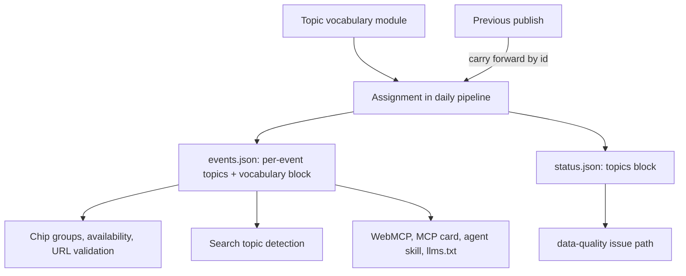
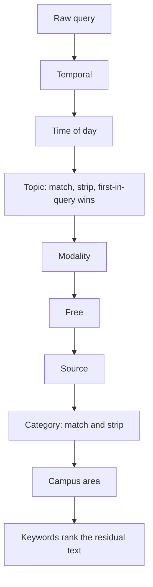
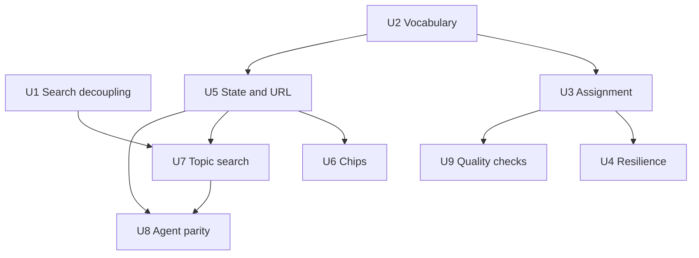

# feat: Topic filter layer

## Summary

Add a per-event `topics` field to the published feed, assigned in the daily pipeline from a versioned vocabulary of roughly 20 slugs, and expose it as a second independent filter beside the category pills, in search interpretation, in URL state, and on every agent surface. The search decoupling ships first as its own change, because it is a contained fix to one file and delivers most of the observed pain relief on its own.

---

## Problem Frame

Category is the only subject filter, and it is too coarse: Academic alone holds 557 of 1,450 events, mixing plant-biology seminars with free coffee hours and HR training. Typing a subject word does not rescue this. The engine's category detector treats "AI" as a request for Science & Tech and applies it as a hard pool filter before ranking, so 40 of the 56 AI-related events, the ones living in Academic, Arts, and Entrepreneurship, are removed before the text engine ever scores them.

Two properties of the current code make this fixable cleanly rather than as a rewrite. First, the text engine already ranks correctly once the lock is off. Second, the category branch in `buildSearchPlan` is the only detector that does not strip its matched words from the query text, so the subject word is still available for ranking after the lock is removed. That asymmetry is why removing subject words from the category trigger table is a small, safe change rather than a behavioral gamble.

---

## Key Technical Decisions

- KTD1. **Topics get their own published field; they never join `tags[]`.** `tags[0]` is the primary-category contract in at least five places: the pool filter in `hooks/useEventBrowserState.ts`, the same filter and the `category` projection in `agent/webmcpTools.ts`, the guidance in `public/.well-known/agent-skills/search-events/SKILL.md`, and the `g` index field built from joined tags at weight 45 in `scripts/lib/buildIndex.ts`. Putting topics in `tags` would corrupt the category contract and silently reweight every existing query. Serves origin R3, R17.

- KTD2. **The published vocabulary block is the single source; no surface re-enumerates it.** Categories today are hand-listed in `appConfig.ts`, `scripts/lib/normalize.ts`, the WebMCP tool enum, `public/llms.txt`, and the search-events skill. Repeating that pattern for topics means five edits per rename, and the origin predicts renames. Instead the pipeline emits a vocabulary block alongside the events, and the interface, URL validation, and agent surfaces read it. Serves origin R1, R16, R17.

- KTD3. **Slug is the identifier; label is display-only.** URL params and agent arguments carry the slug, so a label change never breaks a shared link or a stored agent call. Serves origin R1, R15.

- KTD4. **Topic detection runs first in `buildSearchPlan` and strips its matched words.** The detector order today is temporal, time-of-day, modality, free, source, category, campus area. Topic must precede modality, free, and category so one query word sets at most one hard filter. The concrete collision this prevents: "free food" currently sets `filters.free` through `RE_FREE` and also locks the Student Life category, and would additionally set a Free Food topic, intersecting three ways to a smaller set than any one of them. Serves origin R12.

- KTD5. **Fix the category detector's missing strip while we are in the file.** Every other detector calls `stripIntent`; the category branch does not. Leaving it inconsistent means a future subject word added to the category table would silently double-apply. This is the latent asymmetry that makes U1 safe, so it is worth making explicit rather than depending on it by accident.

- KTD6. **Rules-only assignment in v1; no classifier, no new cron secret.** The daily workflow holds exactly one secret today. A classifier adds an API key and a network call to a pipeline that was hardened in June for reliability, and the origin's own constraint is that publish must never wait on it. Rules extending the existing organizer-and-keyword scoring, plus the LiveWhale group signal in KTD7, are expected to clear the precision and recall bars for Fields. Revisit for Interests only if the reference checks in U9 fall short. Serves origin R4, R4b, R5.

- KTD7. **LiveWhale department group-feed membership becomes the top-priority Field signal.** The adapter fetches roughly 40 group feeds, most of them departments that map one-to-one onto seed Fields, then merges by UID first-wins and discards which feed each event came from. Capturing membership during that merge costs nothing extra at fetch time and is higher-confidence than any keyword. Serves origin R4.

- KTD8. **Topic assignment failure reports through a dedicated status block and the data-quality issue path, never through degraded-source flags.** Verified: `shouldShowStaleDataBanner` returns true whenever the degraded-source list is non-empty regardless of data age, and the partial-data banner keys off the top-level `degraded` flag. Routing a topic failure through those would show every visitor a stale-data banner on a feed that is complete and fresh. The August publish-vs-quality rule already established the correct channel. Serves origin R5.

- KTD9. **Topics carry forward by event id when assignment fails.** The orchestrator already loads the previous publish and has a last-good append path for degraded sources. Reusing that read for a by-id topic carry-forward keeps a bad assignment day from emptying every chip and returning nothing to agents. Serves origin R5.

- KTD10. **The search decoupling ships as its own change, before the topic layer.** It touches one file plus a preset and a set of test expectations, and it is independently verifiable. Serves origin's first-deliverable decision.

---

## High-Level Technical Design

The vocabulary is produced once per day and fans out to every consumer, which is what keeps a rename from becoming a five-file edit.

Detector precedence inside `buildSearchPlan` is the other load-bearing shape. Topic runs early and strips, so later detectors never see a word the topic already claimed.

---

## Requirements

Origin requirements are carried by ID. Requirements below that have no origin ID are plan-local.

**Search decoupling (ships first)**

- R1. Subject words that become topics no longer appear in the category trigger table, so they rank as text instead of locking a category. Origin R12.
- R2. The category detector strips its matched words from the query text, matching every other detector. Plan-local; see KTD5.
- R3. The hero preset that pairs an AI query with a hardcoded Science & Tech category no longer forces the category. Origin's deferred-to-planning item.

**Topic vocabulary and assignment**

- R4. A vocabulary of roughly 20 topics in two groups, each with a stable slug, a display label, and a group. No slug or label duplicates a category name. Origin R1.
- R5. Every published event carries zero to three topic slugs. An event with no confident topic carries none. Origin R2.
- R6. Topics are assigned in the daily pipeline and published in the events file. The browser filters on the field; it never classifies. Origin R3.
- R7. Spot-checking any topic finds at least nine in ten events clearly relevant. Origin R4.
- R8. For each Fields topic with a reference set, at least nine in ten reference events carry the topic. Origin R4b.
- R9. Assignment never blocks publishing. Events present in the previous publish keep their prior topics by id; only never-seen events go untagged. Origin R5.
- R10. The status report carries a topics block with outcome, assigned count, and carried-forward count. Failures open or update a data-quality issue and leave degraded-source flags untouched. Origin R5.

**Topic filter in the interface**

- R11. The topic control sits with the existing filter bar and is reachable whether or not a category is selected. Origin R6.
- R12. Topics render as chips in two labeled groups, most common first, with every topic reachable and no silent horizontal overflow at laptop widths. Origin R7.
- R13. Topics are reachable from the mobile filter drawer. The active topic counts in the Filters badge and appears in the drawer summary line. Origin R7b.
- R14. Selecting a topic shows every event carrying it across all categories, subject to the active date range and source. Origin R8.
- R15. A category and a topic can be active together; the result is events matching both. Origin R9.
- R16. One topic is active at a time. Selecting another replaces it. Clicking the active chip clears it, and that same action is what the interpretation chip's dismiss triggers. Origin R10, R14.
- R17. A topic's availability is computed from every active filter, not the date range alone. An active topic that a later filter change empties is cleared automatically with a brief note. Origin R11.

**Search interpretation**

- R18. Typing a topic word or synonym sets the topic filter and shows an interpretation chip. It does not set a category. Origin R12.
- R19. Topic detection precedes category, free, and modality detection and strips its matched words, so a query word sets at most one hard filter. Origin R12.
- R20. When a query contains more than one topic word, the first in query order becomes the filter and the rest rank as text. A clicked chip overrides a typed topic. Origin R12.
- R21. Residual text after topic interpretation still ranks results. Origin R13.
- R22. An empty topic pool relaxes the topic filter with a fallback message, matching the existing category-relaxation shape. Origin R12.

**Shareable state**

- R23. The active topic slug round-trips through the URL alongside the existing params, validated against the published vocabulary. Origin R15.

**Agent parity**

- R24. The WebMCP search tool, MCP server card, agent skill, and machine-readable feed descriptions accept a topic argument validated against the published vocabulary rather than a per-surface enum. The OpenAPI description, which exposes no filter parameters, documents the field and points at the vocabulary. Origin R16.
- R25. The published events file carries the vocabulary block so an agent can discover valid slugs without guessing. Origin R17.

---

## Implementation Units

### U1. Decouple subject words from category triggers

- **Goal:** Typing a subject word ranks across all categories instead of locking one. Ships and is verified on its own, before any topic work.
- **Requirements:** R1, R2, R3. Origin R12, AE1.
- **Dependencies:** none.
- **Files:**
  - `utils/searchEngine.ts` (CATEGORY_PATTERNS, the category branch in `buildSearchPlan`)
  - `appConfig.ts` (the AI hero preset)
  - `scripts/tests/search-engine-runtime.test.mjs`
- **Approach:** Remove from the category table only those words the topic vocabulary will claim: the arts subject words (film, movie, concert, theater, dance, opera, recital, exhibition, museum, poetry), the science and tech subject words (ai, artificial intelligence, machine learning, language models, llm, data science, computer science, eecs, robotics, biotech, genomics), the entrepreneurship subject words (startup, founder, venture, pitch, demo day, entrepreneur), and the student-life subject words (free food, club, social, mixer, info session). Format words stay: seminar, colloquium, lecture, symposium keep mapping to Academic, because format is a deferred layer. Sports words stay, because there is no Sports topic. Add the missing `stripIntent` call to the category branch.
- **Patterns to follow:** the strip-on-match shape every other detector in `buildSearchPlan` already uses.
- **Test scenarios:**
  - Covers AE1. `searchEvents` on the live corpus for "AI" with no date restriction returns no category interpretation chip, and at least 50 of the 56 reference AI events appear in the results.
  - "film screening at bampfa" no longer sets a category and still ranks the BAMPFA film first (existing test, rewritten from a category assertion to a ranking assertion).
  - "Artificial Intelligence" no longer sets a category and still ranks the AI event first, both with and without an index (two existing tests, rewritten).
  - "founder talks tomorrow" keeps the tomorrow date intent and still ranks the founder event first, without an Entrepreneurship lock (existing test, rewritten).
  - Dismissing behavior for "film screening" no longer references a category key (existing test, rewritten).
  - "cal games" still sets Sports and still produces no keywords, proving the sports path is untouched.
  - "free will lecture" still sets Academic and still suppresses the free filter, proving format words and the contextual-free guard are untouched.
  - "student org" retains its Student Life mapping or moves to a topic, whichever the vocabulary in U2 settles; the test asserts whichever is chosen rather than being deleted.
  - A category word that is not a topic, such as "academic", still sets its category and now also strips from the residual text.
- **Verification:** The full script and UI suites pass. Typing "AI" on a local build returns AI events from more than one category above the fold.

### U2. Topic vocabulary and published contract

- **Goal:** One versioned vocabulary that every consumer reads, and a published event field to carry assignments.
- **Requirements:** R4, R6, R25. Origin R1, R3, R17.
- **Dependencies:** none. Can land in parallel with U1.
- **Files:**
  - `scripts/lib/topics.ts` (new: vocabulary definition, slug and label and group, synonym lists used by both assignment and search)
  - `scripts/lib/schema.ts` (optional `topics` on the legacy published shape; vocabulary block on the published payload)
  - `scripts/updateEvents.ts` (emit the vocabulary block)
  - `scripts/tests/topics.test.mjs` (new)
- **Approach:** Define the vocabulary as data, not scattered constants, and export both the ordered list and a slug lookup. Keep the synonym list beside each topic so the search detector in U7 and the assignment rules in U3 cannot drift apart. Publish the block next to the events so the browser and agents read one list. Both the per-event field and the block are additive, so an older client ignoring them keeps working.
- **Patterns to follow:** the Zod-validated publish boundary in `scripts/lib/schema.ts`; the frontend type re-export in `types.ts` picks the new field up automatically.
- **Test scenarios:**
  - Every slug is unique, lowercase, and URL-safe.
  - No slug or label collides with a category name, case-insensitively.
  - Every topic belongs to exactly one of the two groups.
  - Every topic has at least one synonym, and no synonym string is claimed by two topics.
  - The published payload validates against the schema with and without the topics field present.
  - A published event with three topics validates; one with four is rejected.
- **Verification:** `npm run validate` passes with the new module and schema in place, before any assignment exists.

### U3. Topic assignment in the daily pipeline

- **Goal:** Every event gets zero to three topics, at the precision the origin requires.
- **Requirements:** R5, R6, R7. Origin R2, R3, R4.
- **Dependencies:** U2.
- **Files:**
  - `scripts/lib/topics.ts` (assignment scoring)
  - `scripts/sources/livewhale.ts` (record group-feed membership before the UID merge)
  - `scripts/updateEvents.ts` (call assignment before writing)
  - `scripts/tests/topics.test.mjs`
- **Approach:** Score each event across the vocabulary the way `deriveFrontendTags` scores categories, reusing that file's weighting instinct: an explicit high-confidence identity signal outranks title keywords, which outrank organizer text, which outranks description text. The new highest-confidence signal is LiveWhale group membership, which requires the adapter to remember which department feeds contained each UID rather than discarding that at the first-wins merge. Take the top three scorers above a confidence floor; emit nothing when nothing clears it, since the origin prefers absence to a guess.
- **Execution note:** Write the precision and recall checks in U9 against a frozen fixture before tuning the weights, so tuning is measured rather than eyeballed.
- **Patterns to follow:** `deriveFrontendTags` and the ORGANIZER_MAP weighting in `scripts/lib/normalize.ts`; the bounded-concurrency group fetch already in the LiveWhale adapter.
- **Test scenarios:**
  - An event from a physics department group feed receives the physics-and-math topic even when its title contains no physics keyword.
  - An event appearing in two department feeds receives both corresponding topics.
  - An event with a strong title keyword and no group membership still receives the topic.
  - An event whose only signal is a single description mention stays below the floor and receives no topic.
  - A Labor Day picnic receives no AI topic, per the origin's named counterexample.
  - An event that would score four or more topics emits only the top three.
  - Group membership survives the UID merge when the same event appears in the main feed and a group feed.
  - An event from a source with no group feeds is assigned from text signals alone without error.
- **Verification:** A local pipeline run assigns topics to a majority of events, and the U9 checks pass against the frozen fixture.

### U4. Assignment resilience: carry-forward, status, and issue routing

- **Goal:** A bad assignment day degrades topics quietly and never touches the feed or the banners.
- **Requirements:** R9, R10. Origin R5, AE5.
- **Dependencies:** U3.
- **Files:**
  - `scripts/updateEvents.ts` (carry-forward, topics status block)
  - `scripts/lib/schema.ts` (topics block on the status report)
  - `.github/workflows/update-events.yml` (data-quality issue step for topic failures)
  - `scripts/tests/publish-guards.test.mjs`
- **Approach:** The orchestrator already reads the previous publish for the last-good source path; reuse that read to build an id-to-topics map and apply it when assignment fails or returns nothing for an event that existed yesterday. Report through a new topics block on the status report, and route failures to the existing notifier with the data-quality label, the same shape the search-quality step already uses. The degraded-source list and the top-level degraded flag stay untouched, which is what keeps the partial-data and stale-data banners quiet.
- **Patterns to follow:** `appendLastGoodEvents` in `scripts/lib/lastGoodFallback.ts` for the by-id merge shape; the search-quality failure step in the daily workflow for the issue-label routing.
- **Test scenarios:**
  - Covers AE5. Assignment throws; the events file is still written, previously seen events keep yesterday's topics, never-seen events carry none, and the status topics block records the failure and the carried-forward count.
  - Assignment fails and the degraded-source list stays empty, so neither banner predicate fires.
  - An event absent from the previous publish and unassignable this run publishes with no topics rather than blocking.
  - A successful run reports the assigned count and a zero carried-forward count.
  - A topic failure opens or updates a data-quality issue and does not open a pipeline-failure issue.
- **Verification:** Simulating an assignment throw in a local run still produces a complete events file, and the status block names the failure.

### U5. Topic filter state, URL round-trip, and availability

- **Goal:** Topic behaves as a first-class filter in state and in shared links.
- **Requirements:** R14, R15, R16, R17, R23. Origin R8, R9, R10, R11, R15, AE2, AE3, AE7.
- **Dependencies:** U2 for the vocabulary; U3 for real data, though synthetic fixtures unblock development.
- **Files:**
  - `types.ts` (topic on the filter shape)
  - `utils/urlState.ts` (parse, build, and validate the topic param)
  - `hooks/useEventBrowserState.ts` (pool filter, availability, auto-clear)
  - `hooks/useEventBrowserActions.ts` (topic change handler)
  - `hooks/useUrlStateSync.ts` (wire the allowed-topics list)
  - `tests/App.ui.test.tsx`
- **Approach:** Add topic beside category in the filter shape and in the pool filter, so category and topic intersect naturally. Availability is computed over the pool that all other active filters produce, which is the correction the origin makes over a date-only check. Auto-clear runs when the active topic's availability drops to zero after another filter changes. URL validation follows the existing allow-list shape, with the list sourced from the published vocabulary rather than a constant.
- **Patterns to follow:** the category allow-list in `parseUrlState`; the `userSetDateRange` ref pattern for distinguishing explicit choice from inference; the existing dismissed-key reconciliation in `useEventBrowserState`.
- **Test scenarios:**
  - Covers AE2. With Academic selected, selecting the AI topic yields only events tagged both, and the count matches.
  - Covers AE3. With AI active, selecting Law clears AI, activates Law, and the URL reflects Law.
  - Covers AE7. With a source selected that has no events for a topic, that topic is unavailable even though it has events under other sources.
  - An active topic that a date-range change empties is cleared automatically and the note appears.
  - A topic slug absent from the published vocabulary is rejected from the URL and falls back to no topic.
  - A shared link carrying query, date, category, source, topic, and event restores all six.
  - Clicking the active topic chip clears it and removes the param from the URL.
- **Verification:** Round-tripping a link with a topic reproduces the same list; the UI suite passes.

### U6. Topic chips in the filter bar and mobile drawer

- **Goal:** The control is visible to someone who did not know to look for it, on both layouts, without regressing the tab burden.
- **Requirements:** R11, R12, R13. Origin R6, R7, R7b, R7c, AE6, AE8.
- **Dependencies:** U5.
- **Files:**
  - `components/FiltersBar.tsx` (desktop group row; mobile drawer section, badge count, summary line)
  - `appConfig.ts` (any presentation constants the bar needs)
  - `utils/analytics.ts` (topic as a filter type)
  - `tests/App.ui.test.tsx`
  - `tests/e2e/app.e2e.spec.ts`
- **Approach:** Two labeled groups rendered as chips, most common first, with the remainder reachable through an expansion rather than a hidden scroll. On mobile the drawer already has a Category section, a Source section, a badge counting active filters, and a summary line; topics extend all four rather than introducing a new pattern. Two corrections from research change this unit's scope. The skip-to-content link already exists in `components/AppHeaderShell.tsx` targeting the main landmark, so origin R7c is satisfied and this unit verifies it rather than building it. The desktop bar already renders a visible thin scrollbar rather than the hidden one the April audit described, so the overflow work is about the added chip count, not about restoring a missing affordance.
- **Patterns to follow:** the existing category pill markup and active-state styling in both bar variants; the drawer's existing section, badge, and summary-line structure; the analytics filter-type union.
- **Test scenarios:**
  - Covers AE6. At 1024 pixels every topic is reachable through a visible affordance and nothing is cut off without indication.
  - Covers AE8. At mobile width, opening the drawer and selecting a topic updates the badge count and the summary line, and the list matches the desktop result for the same filters.
  - Selecting a topic chip marks it active and clicking it again clears it.
  - An unavailable topic renders in a visibly unavailable state and cannot be activated.
  - Selecting a topic fires one analytics filter event with the topic type and the slug as the value.
  - The skip link still moves focus to the main landmark with the chip groups present.
  - Keyboard traversal reaches the first event card, confirming the tab burden did not regress past the skip link.
- **Verification:** Manual pass at 1024 and 390 pixels; the UI and end-to-end suites pass.

### U7. Topic-aware search interpretation

- **Goal:** Typing a subject word narrows by topic across every category, with defined precedence.
- **Requirements:** R18, R19, R20, R21, R22. Origin R12, R13, R14, AE1.
- **Dependencies:** U1, U2, U5.
- **Files:**
  - `utils/searchEngine.ts` (topic detector, dismissal, pool filter, fallback)
  - `scripts/tests/search-engine-runtime.test.mjs`
- **Approach:** Insert topic detection ahead of modality, free, source, and category, matching against the vocabulary synonyms from U2 and stripping on match so later detectors never see the claimed word. Multi-topic queries take the first in query order as the filter and leave the rest as ranking text. The dismissal helper needs a topic case beside the existing per-field cases, including the re-injection of the dismissed label as searchable text that category and source already do. The empty-pool fallback mirrors the existing drop-category branch, relaxing the topic and explaining the relaxation.
- **Patterns to follow:** the strip-on-match detector shape; the per-field deletion switch in the dismissal helper; the two-stage broaden-then-explain fallback already in `searchEvents`.
- **Test scenarios:**
  - Covers AE1. "AI" sets the AI topic, shows an AI interpretation chip rather than a category chip, and returns AI events from more than one category.
  - "AI law" sets the AI topic and leaves "law" as ranking text, and reversing the word order sets the Law topic instead.
  - A clicked topic chip overrides a typed topic word in the same session.
  - "free food" sets the Free Food topic and does not additionally set the free flag or a category, proving the one-hard-filter rule.
  - "AI ethics" narrows to AI and ranks ethics-related events above other AI events.
  - Dismissing the topic interpretation chip removes the topic filter and re-runs across all events, with the dismissed label still contributing to ranking.
  - A topic with no events in the active date range relaxes with a fallback message rather than returning empty.
  - A query with no topic word leaves the topic filter unset.
- **Verification:** The corpus queries from the origin's problem frame return the counts the acceptance example names.

### U8. Agent-surface topic parity

- **Goal:** Anything a person can filter by, an agent can filter by, without a per-surface enum to keep in sync.
- **Requirements:** R24, R25. Origin R16, R17, AE5 for the failure case.
- **Dependencies:** U5, U7.
- **Files:**
  - `agent/webmcpTools.ts` (topic argument on the search tool, topic on the event projection, topic in the URL-workspace tools)
  - `public/.well-known/mcp/server-card.json`
  - `public/.well-known/agent-skills/search-events/SKILL.md` and the skills index
  - `public/llms.txt`, `public/llms-full.txt`
  - `public/openapi.json`
  - `scripts/tests/webmcp-tools.test.mjs`, `scripts/tests/agent-readiness.test.mjs`
- **Approach:** Validate the topic argument against the published vocabulary rather than restating it as a JSON-schema enum, so a vocabulary change is a pipeline change only. The URL-building and URL-applying tools gain topic alongside the existing params, keeping the agent's shareable state identical to the UI's. The skills index carries content digests, so any skill file edit requires regenerating them.
- **Patterns to follow:** the existing source and category argument handling in the search tool; the digest regeneration the agent-readiness test enforces.
- **Test scenarios:**
  - A search tool call with a topic returns the same events as the UI for the same filters.
  - A search tool call with an unknown topic slug is rejected rather than silently returning everything.
  - The event projection includes the event's topics.
  - Building a URL with a topic produces a link the UI restores to the same view.
  - Applying a URL state with a topic updates the open page.
  - The agent-readiness digests match after the skill files change.
  - The vocabulary block is discoverable from the published feed and lists slug, label, and group.
- **Verification:** The agent parity tests pass and a manual tool call reproduces a UI result set.

### U9. Precision and recall reference checks

- **Goal:** Make the origin's quality bars measurable rather than asserted, without adding a blocking gate to the daily publish.
- **Requirements:** R7, R8. Origin R4, R4b.
- **Dependencies:** U3.
- **Files:**
  - `scripts/tests/fixtures/topic-reference-sets.json` (new: frozen reference sets, starting with the 56 AI events)
  - `scripts/tests/topic-quality.test.mjs` (new)
  - `package.json` (a script entry beside the existing search-quality one)
  - `.github/workflows/update-events.yml` (non-blocking step)
- **Approach:** Freeze reference sets as fixtures rather than recomputing them from the live corpus, because the corpus changes daily and the origin's own count drifts with the matching pattern used. Reference sets are built independently of the assignment rules so the check is not circular. Run alongside the existing corpus search-quality step, which is already non-blocking and already routes failures to a data-quality issue, so the quality bar informs without gating the feed.
- **Patterns to follow:** the corpus search-quality test and its non-blocking workflow step with data-quality issue routing.
- **Test scenarios:**
  - At least nine in ten AI reference events carry the AI topic.
  - Ten random events sampled under each topic are at least nine-tenths relevant against the frozen fixture's expectations.
  - No topic exceeds roughly 150 events across the full corpus, with Free Food explicitly checked because its raw mention count already exceeds that.
  - Every topic with a chip clears a minimum event count, so an empty chip never ships.
  - The check reports per-topic counts on failure rather than a bare assertion, so the vocabulary can be tuned from the output.
- **Verification:** The check runs green locally against a freshly assigned corpus and its failure output is specific enough to tune from.

---

## Sequencing and Dependencies

U1 is independently shippable and should land and be observed before the rest. U2 unblocks both the pipeline and the frontend, so it is the first topic-layer unit. U6 and U9 are the natural stopping points if the work needs to pause: after U6 the feature is usable, and U9 is what tells you whether the vocabulary was right.

---

## Scope Boundaries

### Deferred for later

Carried from the origin: multi-select topics; format facets such as seminar, workshop, screening, and performance; cost and modality facets; reworking the six categories; personalization; and the remaining April audit findings not touched here.

### Deferred to follow-up work

- Ordering and validating the vocabulary against analytics demand. The site already fires search-term and category-click events, and the origin defers pulling a semester of them to planning. That export is a data task with no code dependency, so it should run alongside U3 rather than blocking it, and its output tunes the U2 vocabulary before U6 ships the chips.
- Publishing topics into the search index so ranking can weight them. The index builds from tags today; adding a topic field is a separate change with its own ranking implications.
- Whether topics appear on the event card and in the detail panel. Purely presentational and independent of the filter.

### Outside this plan

The Interests-versus-Fields sequencing question the document review raised is recorded in the origin's own Deferred and Open Questions section. It reverses a decision the brainstorm made deliberately, so it belongs upstream, not here. This plan implements both groups as the brainstorm specified.

---

## Risks and Dependencies

- **The topic vocabulary is unvalidated for the Interests half.** The origin states this plainly: the Fields group reflects how the builder searches, and the Interests group is a reasoned guess. U9's minimum-count check is the guard that keeps an empty or incoherent chip from shipping, but it cannot tell you whether the names are the ones students would reach for. The analytics export in the follow-up list is the cheapest way to find out.
- **Assignment precision is the trust boundary.** Counts on chips expose classification noise immediately. One Labor Day picnic under AI is more damaging than a missing event, which is why the origin sets precision as a hard bar and why U3 emits nothing rather than guessing.
- **The corpus reference count drifts.** The origin's 56 AI events came from one keyword pass on one day; a stricter pattern finds fewer. U9's frozen fixtures exist because of this, and the number in the acceptance example should be read as a property of the fixture, not of the live feed.
- **Test migration in U1 is larger than the source change.** Roughly six existing runtime tests assert a category that a subject word will no longer set. They are rewrites, not deletions: each should assert the new ranking or topic behavior so the coverage survives.
- **The daily pipeline was hardened in June for reliability.** U3 and U4 add work to that path. KTD6's no-classifier decision and KTD8's reporting split are both in service of not reopening that problem.

---

## Success Criteria

- Typing "AI" on the live site returns at least 50 of the 56 reference AI events, drawn from more than one category.
- No single topic chip yields more than about 150 events across the full corpus; Academic's 557 remains reachable only through the category pill.
- Ten random events under any topic are at least nine-tenths relevant.
- The filter bar has no silent horizontal overflow at 1024 pixels and topics are reachable on the mobile drawer.
- An agent calling the search tool with a topic gets the same result set as a person clicking the chip.
- A simulated assignment failure publishes a complete feed with carried-forward topics and no visitor-facing banner.

---

## Sources and Research

- `utils/searchEngine.ts`: `buildSearchPlan` runs detectors in the order temporal, time-of-day, modality, free, source, category, campus area. The category branch is the only one that does not call `stripIntent`, which is why subject words survive into the ranked text today and why U1 is safe. `applyPoolFilters` applies plan filters as hard filters before scoring; the empty-result fallback broadens the date range first, then drops the category. `withDismissedInterpretations` deletes filters by field prefix and re-injects dismissed category and source labels as searchable text.
- `hooks/useEventBrowserState.ts`: the pool filter matches `event.tags?.[0]` against the selected category, which is the primary-category contract KTD1 protects. Explicit filter-bar selections already override query-interpreted ones through the effective-dismissed-keys mechanism, which is the precedent for R20's clicked-chip-wins rule.
- `agent/webmcpTools.ts`: projects `category` from `tags[0]` and applies the same primary-tag pool filter; the search tool enumerates categories as a JSON-schema enum, the duplication KTD2 avoids repeating.
- `scripts/lib/buildIndex.ts`: the `g` field is built from joined tags at weight 45, so anything added to `tags` is silently indexed and reweighted.
- `scripts/lib/normalize.ts`: `deriveFrontendTags` scores organizer identity at 100, source tags at 40, title keywords at 10, organizer text at 8, and description at 3. This is the weighting instinct U3 mirrors.
- `scripts/sources/livewhale.ts`: roughly 40 department group feeds are fetched with bounded concurrency and merged into the main feed by UID with first-wins semantics, discarding which feed each event came from. That discarded membership is KTD7's signal.
- `scripts/updateEvents.ts` and `scripts/lib/lastGoodFallback.ts`: the orchestrator loads the previous publish and appends last-good events per degraded source, deduping by id. That read is what U4's by-id topic carry-forward reuses.
- `utils/staleDataUi.ts` and `utils/statusUi.ts`: the stale-data banner fires whenever the degraded-source list is non-empty regardless of data age, and the partial-data banner keys off the top-level degraded flag. Verified, and the reason KTD8 keeps topic failures out of those fields.
- `.github/workflows/update-events.yml` and `scripts/notifyPipelineFailure.mjs`: the corpus search-quality step runs non-blocking and routes failures to a data-quality issue through an issue-label environment variable. U4 and U9 reuse that exact shape.
- `components/FiltersBar.tsx`: the desktop bar renders date pills, category pills, and the source dropdown in a horizontally scrolling container with a visible thin scrollbar. The April audit described a hidden scrollbar; that detail is stale. The mobile bar puts category and source behind a Filters toggle with an active-count badge and a summary line, which R13 extends.
- `components/AppHeaderShell.tsx` and `App.tsx`: a "Skip to events" link already exists and targets the main landmark. Origin R7c is therefore already satisfied; U6 verifies rather than builds it.
- `scripts/tests/search-engine-runtime.test.mjs`: eleven assertions on interpreted categories. Six depend on words U1 removes and need rewriting; the sports and format-word assertions are unaffected.
- `scripts/tests/search-quality.test.mjs`: the "ai returns Science & Tech" golden test scores against the published index directly rather than through `buildSearchPlan`, so U1 does not break it. The engine-level assertions in the same file cover cal-games, berkeley-law, and career-fair queries, none of which U1 touches.
- `docs/brainstorms/2026-08-17-publish-vs-quality-pipeline-requirements.md`: establishes that corpus-quality problems publish anyway and open a low-priority data-quality issue, reserving operator alerts for backbone-source and feed-age failures. KTD8 and U9 follow that rule.
- `docs/plans/2026-06-19-001-fix-cron-pipeline-reliability-plan.md`: the June work that decoupled the publish path from non-publish gates. The reason KTD6 avoids adding a network dependency to the daily run.
